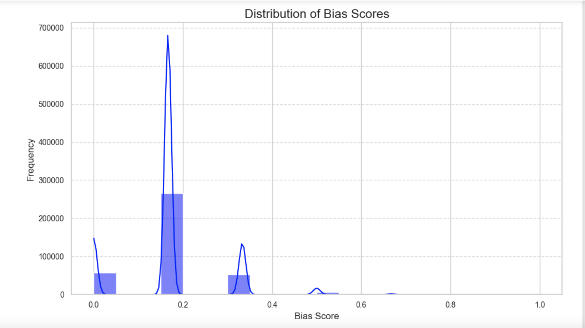

## Gender Bias  Classification Modeling as a Foundation for Headline Objectivity
Madeline F. Birch | November 2023 | Flatiron School Data Science Program | Final Capstone Project

# Project Overview
In an era where information shapes perspectives, the media plays a pivotal role in influencing societal narratives. Understanding the subtle nuances and potential biases embedded in headlines is crucial, and this project aims to shed light on the degree of bias present in headlines. Focusing on data classification through machine learning, the project seeks to predict headlines into three classes: No Bias, Low Bias, and High Bias. The objective is not to scrutinize sensationalism or analyze sentiment polarity but rather to leverage textual and numerical features to predict the bias level accurately.

### Our Stakeholder: PBS News
PBS News, a revered American news source, is known for its impartiality and lack of apparent agenda. Publicly funded by 15%, the entity continuously faces accusations of general bias and [threats of defunding from various actors](https://www.nytimes.com/2011/02/28/business/media/28cpb.html). By adopting insights gained from our efforts, PBS News can *silence these threats* and *secure its value* as a trusted source for objective, unbiased headlines.

### Our Vision: Gender Bias in Headlines as a Framework
We chose to focus on gender bias as a focus for this project because it is undeniably one of the most prevalent forms of bias in published news content. See: [study](https://www.frontiersin.org/articles/10.3389/frai.2021.664737/full)& [study].(https://journals.plos.org/plosone/article?id=10.1371/journal.pone.0245533) 

At the heart of this initiative is the recognition of headlines as powerful agents that shape our perceptions. While our primary focus is gender bias in headlines, this project could serve a framework for ongoing assessments of headlines across diverse bias types, including political, racial, LGBTQ+, socioeconomic class and beyond.

# The Dataset

The dataset utilized in this project originates from a comprehensive collection of data scraped for ["When Women Make Headlines,"](https://pudding.cool/2022/02/women-in-headlines/) a visual essay published by [*The Pudding*](https://pudding.cool/) in June 2022.

**Working file**: `headlines.csv` 
**Target variable**:`bias`

# Data Understanding

EDA shows:
- Our DataFrame is fairly large, with a shape of(382139, 5). We will need to filter the dataset down a bit given the limitations of our project.
- The target variable 'bias' is quite imbalanced, as the majority of instances (265271) have a bias score of 0.166667.
- Because there are only 6 distinct bias scores, we will be treating the numerical bias scores as categorical. 

# Data Preparation

We cleaned and filtered the data, engineering features along the way for better data understanding and future implementation. 
Then, we preprocessed 'headlines' text data by tokenizing, lemmatizing, and vectorizing the text for modeling.

## Evaluation metric: weighted average F1 score
The Weighted Average F1 score is an appropriate evaluation metric for predicting headline bias categories across all models due to its ability to balance precision and recall while accounting for class imbalance.

# Modeling

Here are the models we ran and evaluated:

### Simple Models:
- Logistic Regression
- Random Forest
- Support Vector Machine

### Complex Models:
- Basline Neural Net (NN)
- NN with Dropout Rate 
- NN with L2 Regularization
- NN with Batch Normalization
- Multilayer Perceptron (MLP) with Batch Normalization
- Long Short-Term Memory (LSTM)

all our neural networks models, aside from L2 Regularization, all with weighted average F1 scores of 51%, have at least improved upon the baseline neural network.

# Findings

**Best performing WAF1 scores:**
- NN with Dropout: 51%
- NN with Batch Normalization: 51%
- MLP with Batch Normalization: 51%

**Moderate WAF1 score:**
- Simple NN: 47%

**Poor WAF1 scores:**
- NN with L2 Reg: 3%
- LSTM with Batch Normalization and Dropout: 3%

# Recommendations

Since best performing models involved adding batch normalization and dropout...
- **Continue to test neural networks with batch normalization and different dropout rates**, employing activation functions like LeakyReLU, and experimenting with different batch sizes, number of epochs, and learning rates.
- **Build on Multilayer Perceptron by adding layers.**
- **Plot loss functions for best performing models** to better understand the dynamics of the training process and make informed decisions about model architecture

### FairFrame: A Bias Mitigation Tool for Writers and Editors

PBS needs to back up its reputation as an objective American news source and defend itself against actors threatening to defund it on accusations of bias. In order to achieve this, we propose FairFrame - a simple app or pop-up browser extension — for writers and editors at PBS. This tool uses optimized neural networks identifying bias categories in headlines throughout the editorial process.

- **Headline Input:** Users can feed headlines into the tool for analysis.
- **Bias Categorization:** The tool employs a pretrained model to categorize the bias of the content into different levels (e.g., Neutral, Low Bias, High Bias).
- **Guided Editing Notes:** For content flagged with bias, the tool's various pre-loaded functions provide users with actionable and specific editing suggestions. For instance: "Consider neutralizing language in this sentence." OR "Use active voice for greater clarity and objectivity." OR "Adjust the tone to ensure a balanced representation."
- **User-Friendly Interface:** The tool features an intuitive and user-friendly interface, ensuring seamless integration into the editorial workflow.

**The Bottom Line:** FairFrame has the potential to enhance objectivity, empower writers and editors, hold all writers and editors to consistent standards, and promote efficient editing.

**Implementation**:
- Collaborate with machine learning experts to fine-tune the bias categorization model based on PBS's editorial guidelines.
- Conduct thorough training sessions for writers and editors to ensure effective utilization of the tool.
    
**Additional Recommendations:**
- Publish each article's headline bias score in plain view for readers to see
- Advertise and demonstrate the use and efficacy of FairFrame in public funding defense efforts
